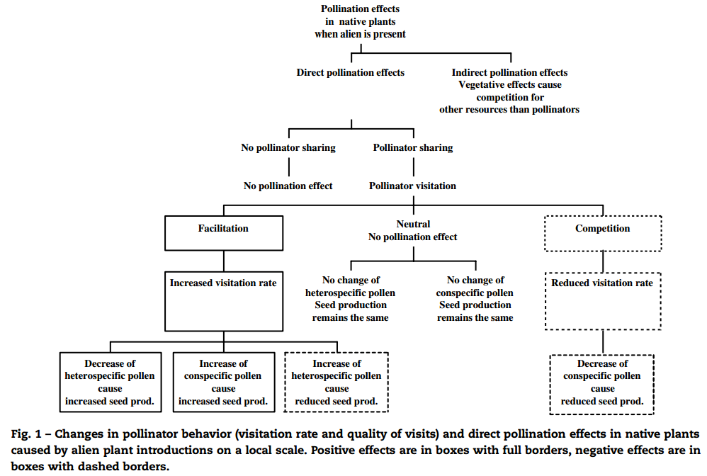

# Citable ideas

## Mutualism & general facts

* Obligate mutualisms are more common in the trophics, facultative mutualisms are more common in the temprate areas. That doesn't mean they are less important. Just more flexible. Reasons might be related to costly phenology during winter for example [@May1982]

* Population dynamic models of mutualism there is an explosion of positive feedback and runaway in the populations [@May1982], that is related to invasion meldown [@Simberloff1999]

## Global change

* Mutualistic interactions are generally affected negatively by global change [@Tylianakis2008]

* Global change (temperature increasses) disrupt plant pollinator networks by making phenologies missmatch or spatial distributions change and local abbundances [@Memmott2007; @Hegland2009]

* Habitat fragmentation, habitat modification and other neggative impact references are in [@Tylianakis2008]

* Effects of defaunation

## Invasive species & mutualisms

* Pollination is a key proces fior the establishment of invasive species and the community assemby [@Sargent2008]

* Successful invasive species tend to be super-generalists [@Richardson2000; @Vila2009]
    - Non suitable pollinators limit the spread of alien species, those that can have pollinators are more likely to necome invasive [suggested by @Richardson2000]
    - Often alien species require efficient symbionts (pollinators, seed dispersers, mycorrhiza) to become invasive [@Richardson2000]

* From the competitive point of view more diverse communities should be less prone to invasion, from the mutalistic more diverse facilitates invasion. More diverse native can have more diverse invasive species [@Richardson2000]

* Invaders use efficiently available pollinators [@Richardson2000]

* Invasive plants affect the others trough two mechanisms [@Bjerknes2007]:
    - Effects on pollinator populations: Positive for example by supporting pollinators with more resources, especially in different times as the natives. Neggative as for example being toxic for pollinator larvae
    - Effects on pollinator behaviour:

    

* There is evidence that native plants that have similar traits (morphological at least) to invaders might have a receive less visits than before [@Morales2009], there is also evidence that they dont [@Vila2009]

* Invaded communities receiver more pollination visits in total[@Vila2009]

* Invasive species don't induce overall changes in network structure (connectance, plant linkage level, and nestedness) [@Vila2009], but that might depend on the degree of invasion [@Aizen2008]

* @Aizen2008 found that although total connenctance is maintained, links get transfered between native generalists to invasive generalists, an increasse in connectance in invasors and a decreasse in natives

* Highly invaded networks exhibit weaker mutualism (i.e. less reciprocal interdependence) that less invaded webs [@Aizen2008]

* Suggesting evidence that the impact of invading plants might be less worse than invading pollinators [@Vila2009] or complexes of invasive species when an invader facilitates further invaders; explained by @Simberloff2006 and proposed by @Simberloff1999

* Invasion meltdown [@Simberloff2006]. Mutualistic invasive species enter an "autocatalytic" process, and accelerate their spread and impact on the ecosystem., an invasive seed disperser ant facilitates the recruitment of an invasive plant that interacts strongly with it [@Prior2014]; *Ficus* only became invasive in Florida and New Zealand after the introduction of their specific plant pollinator [@Richardson2000]

* However @Olesen2002 didn't found invader complexes to be pervasive in oceanic islands. Instead, invaders get successfully assimilated by native super generalists

* A reason for a pollen pool: Visitation frequency is a surrogate of total interaction effect [@Vazquez2005], but that only takes into account immediate consequences of pollen deposition or seeds removal, not take into account fraction of outcrossed pollen or germination rate/defecated seeds. Relationship between visitation and effect is not linear. eg. infinite visitation doesn't lead to infinite benefit (saturation of polen). It can be bellshaped.

* Studies that explored the effects of invasions on network "stability" (in the broad sense): @Olesen2002, @Aizen2008, @Bartomeus2008, @Vila2009

## Stability

* Coexistence stable states makes throphic networks less connected, less nested and more modular than intial parameters before equilibrium [@Thebault2010]

* Interaction diversity, nestedness, distributions and patterns of interaction strength, compartmentalization and degree distribution are structural network factors though to have an impact on stability [@Tylianakis2010]

### In mutualistic networks

* Asymetric networks (so that if a plant species depends strongly on an animal species, the animal depends weakly on the plant) facilitate coexistence [@Bascompte2006]

* Coexistence stable states makes mutualistic networks more connected, more nested and less modular than intial parameters before equilibrium [@Thebault2010]

*

Bascompte2006,Rooney2006,Okuyama2008,Thebault2010,Rohr2014,Sauve2014

## Polen pool

* Mutualism facilitate plant reproduction, yet it is well recognised that mutualismns can be substantually altered if co-flowering species compete for the serviices of shared pollinators [@Sargent2008, @Mitchell2009].

* Ine step further: Studies of pairwise interactions have shown that an alien plant can affect the pollination of a native plant, this effect being mediated by shared pollinators [@Lopezaraiza-Mikel2007]

* Overall neggative effect of invasive species in native pollination services Reviewed by @Morales2009

* Competition for pollinators is termed Interspecific Polen Transfer, which can be divided into heterospecific pollen deposition and conspecific polen loss [@Morales2008]

* @Ghazoul2006 deals with apparent facilitation and competition in  mutualistic networks

* Visitation is correlated with pollen transport, but there is a high proportion of pollinators (~25-35%) that don't carry conspecific pollen [@Alarcon2010]. Pollen transport networks seem to be dominated by alien polen [@Lopezaraiza-Mikel2007]

* Although there might be mechanisms to mitigate the impacts of alien polen (morphological differences on where each type of pollen is attached, individual pollinator fidelity and differnt flower phenologies), polen from invasive species was present in the majority of pollinators [@Bartomeus2008a]

* At high densities alien species negatively affect pollination visitation rates and seed output in natives [@Munoz2008], however it might increasse it at low densities by attracting new pollinators to the community [@Munoz2008]

* Invasive species co-opt pollinators from native ones [@Pysek2011]

## Coexistence

* Alternatuve model to @Garcia-Algarra2013 is @Fishman2010

## Structure and invasions

* Invasions are more likely in less complex networks @Romanuk2009

## Defaunation

* Defaunation can reduce polen transfer and plant densities [@Nia2011]

### References
